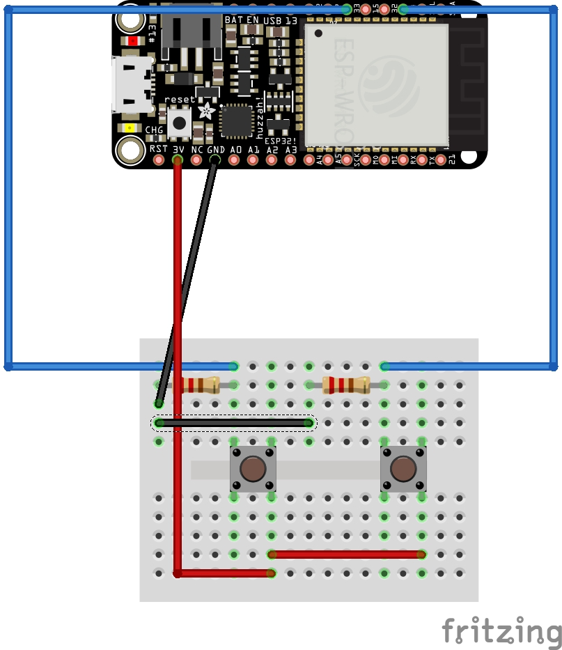
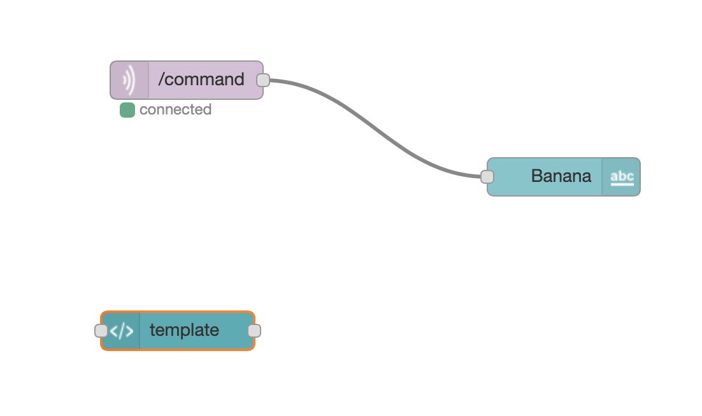
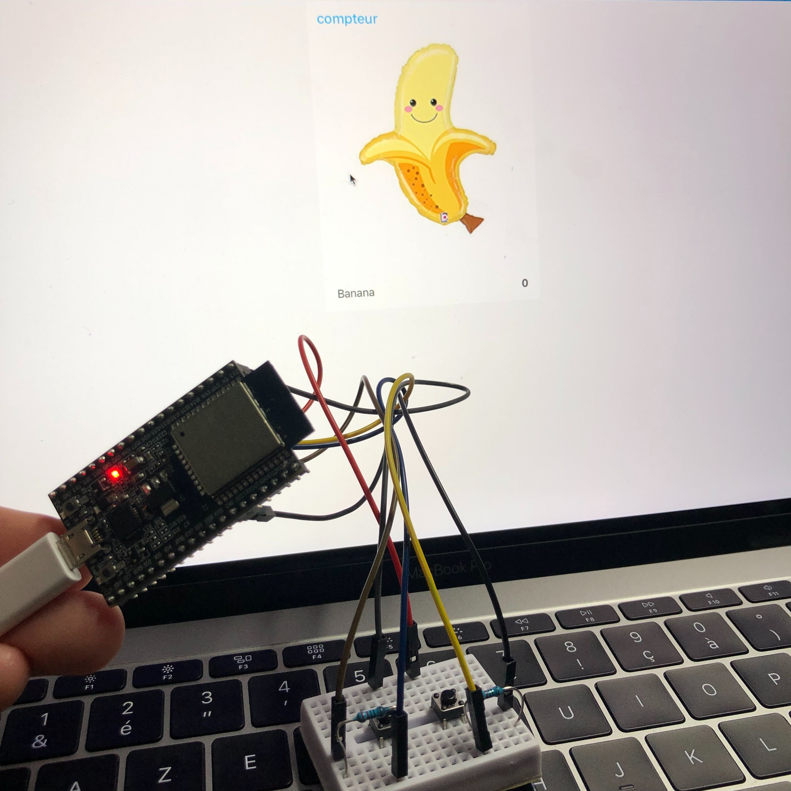

# bouton-de-commande-IoT


Bouton de commande IoT

Ce projet à été réalisé par [@siham](https://github.com/siham87) et [@OSylla92](https://github.com/OSylla92)

## Video :
[](https://www.youtube.com/watch?v=CNCbM1CLmdk)


## **Bibliothéque utilisée**
+ esp32 : [https://github.com/adafruit/Adafruit_MQTT_Library)
+ Wifi : [https://www.arduino.cc/en/Reference/WiFi)
+ uTimerLib : [https://github.com/Naguissa/uTimerLib]

## **Matériel**
+ esp32
+ button


## **Montage**



## **Code**

```
#include <uTimerLib.h>

#include <WiFi.h>
#include <Adafruit_MQTT.h>
#include <Adafruit_MQTT_Client.h>

int compteur = 0;

WiFiClient wiFiClient;
Adafruit_MQTT_Client mqttClient(&wiFiClient, "192.168.0.101", 1883);
Adafruit_MQTT_Publish commandPublisher(&mqttClient, "/command");

void buttonsTimer() {

    int buttonadd = digitalRead(14);
    int buttonless = digitalRead(27);
    
    Serial.println(compteur);

    
    if (buttonadd) {
       compteur++;
       commandPublisher.publish(compteur);
    }

    if (buttonless) {
      compteur--;
      commandPublisher.publish(compteur);
     }
     
  
}

void setup() {
  
    pinMode(14, INPUT);
    pinMode(27, INPUT);

    Serial.begin (115200);
    WiFi.begin("createch2019", "createch2019");
    delay(2000);
    Serial.print("IP address: ");
    Serial.println(WiFi.localIP());
      TimerLib.setInterval_s(buttonsTimer, 1);

}

void loop() {    
    if (mqttClient.connected()) {
       mqttClient.processPackets(10000);
       mqttClient.ping();
    }   else {
      mqttClient.disconnect();
      mqttClient.connect();
    }
}
```
## **Node-Red**




